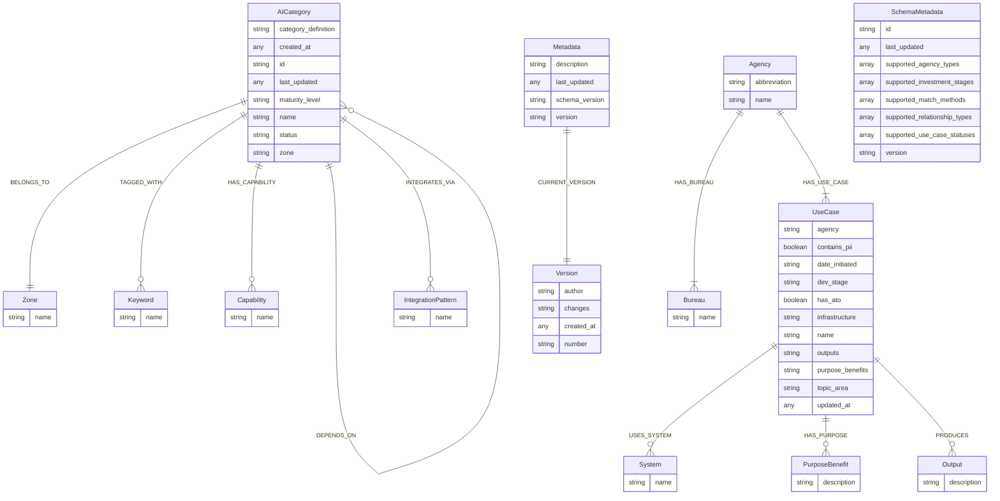

# Neo4j Database Schema Visualization

Generated at: 2025-02-06T21:38:02.323560

## Schema Diagram

This diagram shows the complete database schema including entities, relationships, and their properties.

### Legend
- Boxes represent entities (node labels)
- Lines represent relationships between entities
- Relationship cardinality is shown using crow's foot notation:
  - `||` One
  - `o|` Zero or one
  - `}|` One or many
  - `}o` Zero or many

### Cardinality Examples
- `||--||` One-to-one relationship
- `||--|{` One-to-many relationship
- `}o--o{` Many-to-many relationship
- `||--o{` One-to-zero-or-many relationship

## Database Schema Diagram



## Schema Statistics

- Total Node Types: 14
- Total Relationship Types: 11

### Node Types Overview

#### AICategory
- Total Properties: 8
- Properties:
  ```
  id: string
  status: string
  maturity_level: string
  name: string
  created_at: unknown
  last_updated: unknown
  category_definition: string
  zone: string
  ```
- Outgoing Relationships: 5
  ```
  - BELONGS_TO
  - DEPENDS_ON
  - HAS_CAPABILITY
  - INTEGRATES_VIA
  - TAGGED_WITH
  ```
- Incoming Relationships: 0
  ```
  ```

#### Keyword
- Total Properties: 1
- Properties:
  ```
  name: string
  ```
- Outgoing Relationships: 0
  ```
  ```
- Incoming Relationships: 1
  ```
  - TAGGED_WITH
  ```

#### Capability
- Total Properties: 1
- Properties:
  ```
  name: string
  ```
- Outgoing Relationships: 0
  ```
  ```
- Incoming Relationships: 1
  ```
  - HAS_CAPABILITY
  ```

#### Zone
- Total Properties: 1
- Properties:
  ```
  name: string
  ```
- Outgoing Relationships: 0
  ```
  ```
- Incoming Relationships: 1
  ```
  - BELONGS_TO
  ```

#### IntegrationPattern
- Total Properties: 1
- Properties:
  ```
  name: string
  ```
- Outgoing Relationships: 0
  ```
  ```
- Incoming Relationships: 1
  ```
  - INTEGRATES_VIA
  ```

#### Version
- Total Properties: 4
- Properties:
  ```
  author: string
  created_at: unknown
  number: string
  changes: string
  ```
- Outgoing Relationships: 0
  ```
  ```
- Incoming Relationships: 1
  ```
  - CURRENT_VERSION
  ```

#### Metadata
- Total Properties: 4
- Properties:
  ```
  description: string
  last_updated: unknown
  schema_version: string
  version: string
  ```
- Outgoing Relationships: 1
  ```
  - CURRENT_VERSION
  ```
- Incoming Relationships: 0
  ```
  ```

#### UseCase
- Total Properties: 11
- Properties:
  ```
  has_ato: boolean
  topic_area: string
  updated_at: unknown
  contains_pii: boolean
  date_initiated: string
  name: string
  agency: string
  purpose_benefits: string
  outputs: string
  dev_stage: string
  infrastructure: string
  ```
- Outgoing Relationships: 2
  ```
  - HAS_PURPOSE
  - PRODUCES
  ```
- Incoming Relationships: 1
  ```
  - HAS_USE_CASE
  ```

#### Agency
- Total Properties: 2
- Properties:
  ```
  name: string
  abbreviation: string
  ```
- Outgoing Relationships: 2
  ```
  - HAS_BUREAU
  - HAS_USE_CASE
  ```
- Incoming Relationships: 0
  ```
  ```

#### Bureau
- Total Properties: 1
- Properties:
  ```
  name: string
  ```
- Outgoing Relationships: 0
  ```
  ```
- Incoming Relationships: 1
  ```
  - HAS_BUREAU
  ```

#### Output
- Total Properties: 1
- Properties:
  ```
  description: string
  ```
- Outgoing Relationships: 0
  ```
  ```
- Incoming Relationships: 1
  ```
  - PRODUCES
  ```

#### PurposeBenefit
- Total Properties: 1
- Properties:
  ```
  description: string
  ```
- Outgoing Relationships: 0
  ```
  ```
- Incoming Relationships: 1
  ```
  - HAS_PURPOSE
  ```

#### System
- Total Properties: 1
- Properties:
  ```
  name: string
  ```
- Outgoing Relationships: 0
  ```
  ```
- Incoming Relationships: 1
  ```
  - USES_SYSTEM
  ```

#### SchemaMetadata
- Total Properties: 8
- Properties:
  ```
  id: string
  supported_investment_stages: list
  supported_agency_types: list
  supported_use_case_statuses: list
  supported_match_methods: list
  last_updated: unknown
  supported_relationship_types: list
  version: string
  ```
- Outgoing Relationships: 0
  ```
  ```
- Incoming Relationships: 0
  ```
  ```

### Relationship Types Overview

#### BELONGS_TO
- Properties:
  ```
  ```
- Source Node Labels:
  ```
  - AICategory
  ```
- Target Node Labels:
  ```
  - Zone
  ```

#### TAGGED_WITH
- Properties:
  ```
  weight: integer
  ```
- Source Node Labels:
  ```
  - AICategory
  ```
- Target Node Labels:
  ```
  - Keyword
  ```

#### HAS_CAPABILITY
- Properties:
  ```
  ```
- Source Node Labels:
  ```
  - AICategory
  ```
- Target Node Labels:
  ```
  - Capability
  ```

#### DEPENDS_ON
- Properties:
  ```
  created_at: unknown
  cross_zone: boolean
  ```
- Source Node Labels:
  ```
  - AICategory
  ```
- Target Node Labels:
  ```
  - AICategory
  ```

#### INTEGRATES_VIA
- Properties:
  ```
  ```
- Source Node Labels:
  ```
  - AICategory
  ```
- Target Node Labels:
  ```
  - IntegrationPattern
  ```

#### CURRENT_VERSION
- Properties:
  ```
  ```
- Source Node Labels:
  ```
  - Metadata
  ```
- Target Node Labels:
  ```
  - Version
  ```

#### HAS_BUREAU
- Properties:
  ```
  ```
- Source Node Labels:
  ```
  - Agency
  ```
- Target Node Labels:
  ```
  - Bureau
  ```

#### HAS_USE_CASE
- Properties:
  ```
  ```
- Source Node Labels:
  ```
  - Agency
  ```
- Target Node Labels:
  ```
  - UseCase
  ```

#### USES_SYSTEM
- Properties:
  ```
  ```
- Source Node Labels:
  ```
  - UseCase
  ```
- Target Node Labels:
  ```
  - System
  ```

#### HAS_PURPOSE
- Properties:
  ```
  ```
- Source Node Labels:
  ```
  - UseCase
  ```
- Target Node Labels:
  ```
  - PurposeBenefit
  ```

#### PRODUCES
- Properties:
  ```
  ```
- Source Node Labels:
  ```
  - UseCase
  ```
- Target Node Labels:
  ```
  - Output
  ```