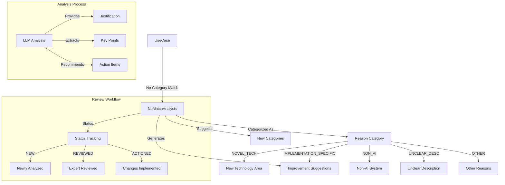
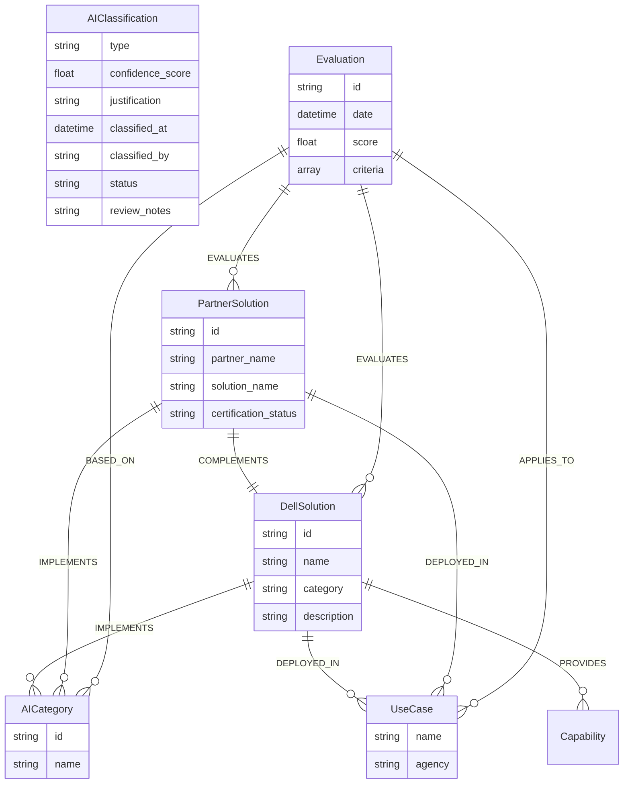
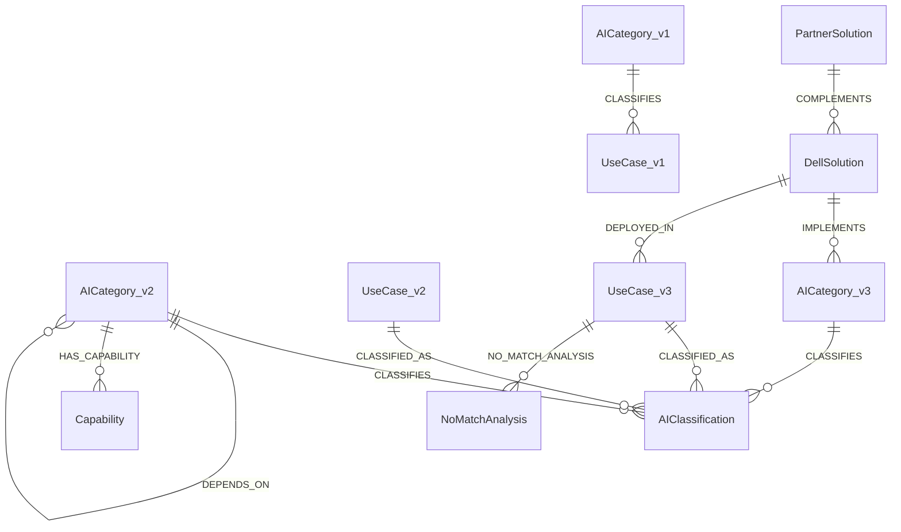

# Dell-AITC Schema Visualization

## Core Schema

```mermaid
erDiagram
    %% Core AI Technology Categories
    AICategory {
        string id
        string name
        string category_definition
        string status
        string maturity_level
        string zone
        datetime created_at
        datetime last_updated
    }

    Zone {
        string name
    }

    Keyword {
        string name
    }

    Capability {
        string name
    }

    IntegrationPattern {
        string name
    }

    %% Federal Use Case Structure
    UseCase {
        string name
        string agency
        string topic_area
        string purpose_benefits
        string outputs
        string dev_stage
        string infrastructure
        boolean has_ato
        boolean contains_pii
        string date_initiated
        datetime updated_at
    }

    %% Classification Relationship
    AIClassification {
        string type              %% PRIMARY, SECONDARY, RELATED
        float confidence_score   %% AI-generated confidence score
        string justification     %% Explanation of classification
        datetime classified_at   %% When the classification was made
        string classified_by     %% AI model or human reviewer
        string status           %% PROPOSED, REVIEWED, APPROVED, REJECTED
        string review_notes     %% Notes from human review
    }

    %% NO_MATCH Analysis Structure
    NoMatchAnalysis {
        string id
        datetime timestamp
        string reason_category     %% NOVEL_TECH, IMPLEMENTATION_SPECIFIC, NON_AI, UNCLEAR_DESC, OTHER
        string llm_analysis        %% Full LLM analysis text
        string improvement_suggestions
        array potential_categories %% Potential new categories to consider
        json best_scores          %% Scores from each method
        datetime analyzed_at
        string analyzed_by
        string status             %% NEW, REVIEWED, ACTIONED
        string review_notes
    }

    Agency {
        string name
        string abbreviation
    }

    Bureau {
        string name
    }

    System {
        string name
    }

    PurposeBenefit {
        string description
    }

    Output {
        string description
    }

    %% Metadata and Versioning
    SchemaMetadata {
        string id
        string version
        array supported_investment_stages
        array supported_agency_types
        array supported_use_case_statuses
        array supported_match_methods
        array supported_relationship_types
        datetime last_updated
    }

    Version {
        string author
        datetime created_at
        string number
        string changes
    }

    %% Core Category Relationships
    AICategory ||--|| Zone : BELONGS_TO
    AICategory ||--o{ Keyword : TAGGED_WITH
    AICategory ||--o{ Capability : HAS_CAPABILITY
    AICategory ||--o{ AICategory : DEPENDS_ON
    AICategory ||--o{ IntegrationPattern : INTEGRATES_VIA

    %% Classification Relationships
    AICategory ||--o{ AIClassification : CLASSIFIES
    UseCase ||--o{ AIClassification : CLASSIFIED_AS
    
    %% NO_MATCH Relationships
    UseCase ||--o{ NoMatchAnalysis : NO_MATCH_ANALYSIS
    NoMatchAnalysis ||--o{ AICategory : SUGGESTS_NEW_CATEGORY
    
    %% Use Case Structure
    Agency ||--|{ UseCase : HAS_USE_CASE
    Agency ||--|{ Bureau : HAS_BUREAU
    UseCase ||--o{ PurposeBenefit : HAS_PURPOSE
    UseCase ||--o{ Output : PRODUCES
    UseCase ||--o{ System : USES_SYSTEM

    %% Metadata Relationships
    SchemaMetadata ||--|| Version : CURRENT_VERSION
```

## NO_MATCH Analysis Flow



## Extension Points



## Schema Evolution



## Cardinality Guide

- `||--||` : One-to-one relationship
- `||--|{` : One-to-many relationship (required)
- `||--o{` : One-to-many relationship (optional)
- `}|--|{` : Many-to-many relationship

## Color Guide

- Core Entities: Primary business objects
- Supporting Entities: Auxiliary data structures
- Extension Points: Future expansion capabilities
- Metadata: Schema versioning and management 