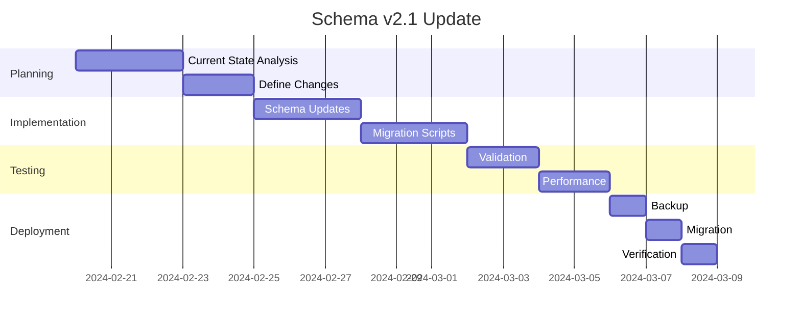

# Schema Update Plan v2.1

## Overview
This document outlines the planning and implementation process for updating the Dell-AITC schema to version 2.1, focusing on accommodating the 2024 Federal inventory data changes.

## Pre-Update Checklist

### 1. Current State Assessment
- [ ] Run schema validator on v2.0
- [ ] Collect current schema metrics
- [ ] Document existing data patterns
- [ ] Identify potential migration challenges

### 2. Backup Requirements
- [ ] Schema JSON backup
- [ ] Node/relationship count snapshots
- [ ] Property usage statistics
- [ ] Query performance baselines

### 3. Testing Environment
- [ ] Set up isolated test database
- [ ] Import sample dataset
- [ ] Configure monitoring tools
- [ ] Prepare rollback procedures

## Update Process

### Phase 1: Schema Definition
1. Document Changes
   - [ ] List all proposed modifications
   - [ ] Update property definitions
   - [ ] Revise relationship rules
   - [ ] Define new constraints

2. Validation Rules
   - [ ] Update schema validator
   - [ ] Add new test cases
   - [ ] Document validation changes

### Phase 2: Implementation
1. Schema Updates
   - [ ] Create v2.1 schema files
   - [ ] Update documentation
   - [ ] Implement new constraints
   - [ ] Update monitoring metrics

2. Migration Scripts
   - [ ] Create data transformation rules
   - [ ] Build migration procedures
   - [ ] Add validation checks
   - [ ] Document rollback process

### Phase 3: Testing
1. Validation Testing
   - [ ] Run schema validator
   - [ ] Test all constraints
   - [ ] Verify relationships
   - [ ] Check property rules

2. Performance Testing
   - [ ] Measure query impact
   - [ ] Check index effectiveness
   - [ ] Monitor memory usage
   - [ ] Document findings

## Implementation Notes

### Schema Changes
```yaml
version: 2.1.0
changes_planned:
  - TBD based on 2024 Federal inventory requirements
  - Updates to property definitions
  - Potential new relationships
  - Modified constraints
```

### Migration Strategy
1. Pre-migration
   - Backup current state
   - Validate existing data
   - Document metrics

2. Migration
   - Apply schema changes
   - Transform data
   - Update indexes

3. Post-migration
   - Validate new state
   - Collect metrics
   - Update documentation

### Rollback Plan
1. Triggers
   - Data inconsistency
   - Performance degradation
   - Validation failures

2. Process
   - Restore schema backup
   - Revert data changes
   - Validate restoration

## Timeline


## Success Criteria
1. Schema Validation
   - All validation tests pass
   - No data inconsistencies
   - Property constraints met

2. Performance
   - Query performance within baseline
   - No significant memory impact
   - Index effectiveness maintained

3. Data Quality
   - No data loss
   - Relationships maintained
   - Property integrity preserved

## Next Steps
1. [ ] Review current schema metrics
2. [ ] Document specific changes needed for 2024 data
3. [ ] Update validation rules
4. [ ] Create test dataset
5. [ ] Begin implementation planning 