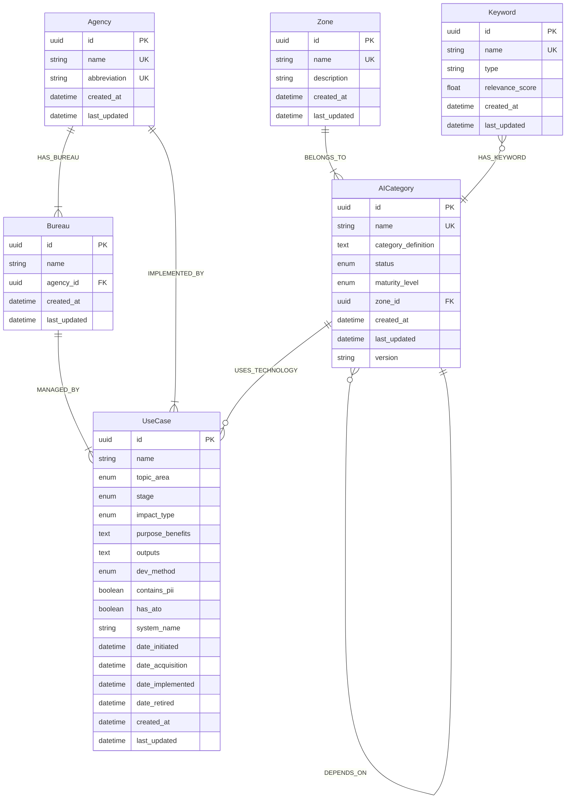
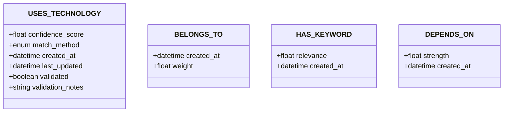
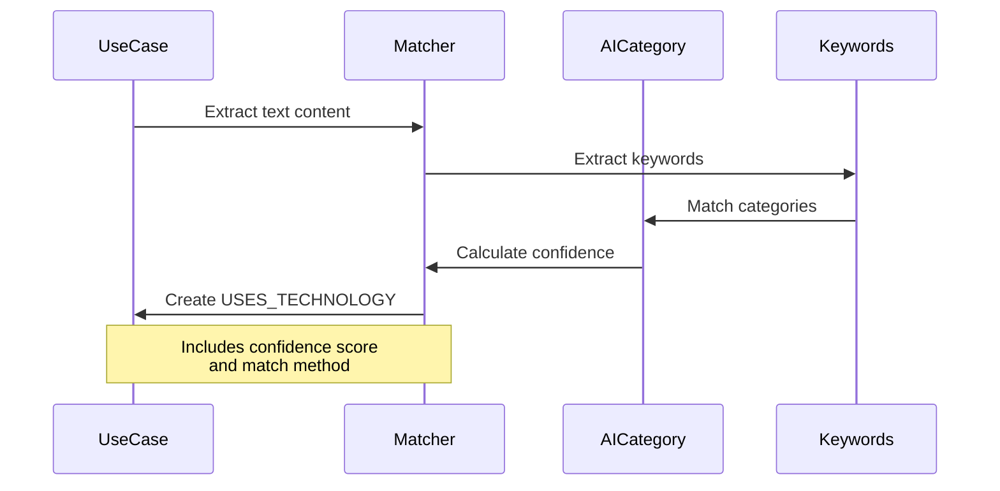
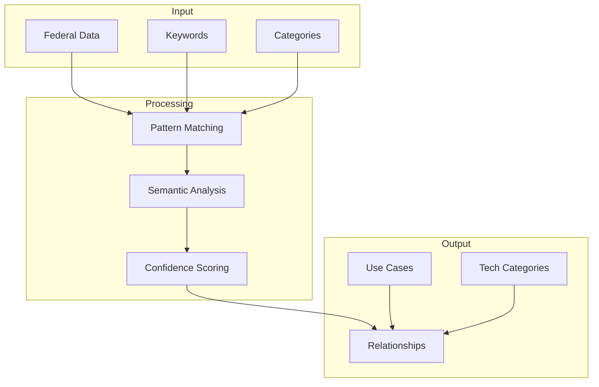

# Dell-AITC Schema Visualization v2.1

## Overview
This document provides a visual representation of the Dell-AITC schema version 2.1, focusing on the relationships between AI technology categories and federal use cases.

## Core Domain Structure

## Relationship Properties

## Classification Flow

## Data Flow

## Legend

### Node Properties
- PK: Primary Key
- UK: Unique Key
- FK: Foreign Key

### Relationship Types
- `||--||` : One-to-one
- `||--|{` : One-to-many (required)
- `||--o{` : One-to-many (optional)
- `}|--||` : Many-to-one (required)
- `}o--||` : Many-to-one (optional)
- `}o--o{` : Many-to-many (optional)

### Property Types
- uuid: Unique identifier
- string: Text value
- text: Long text content
- enum: Enumerated value
- boolean: True/False
- float: Decimal number
- datetime: Timestamp
- array: List of values
- json: Complex data structure 