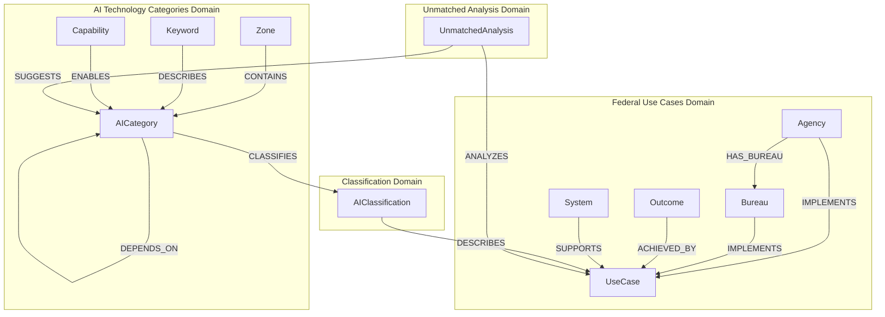
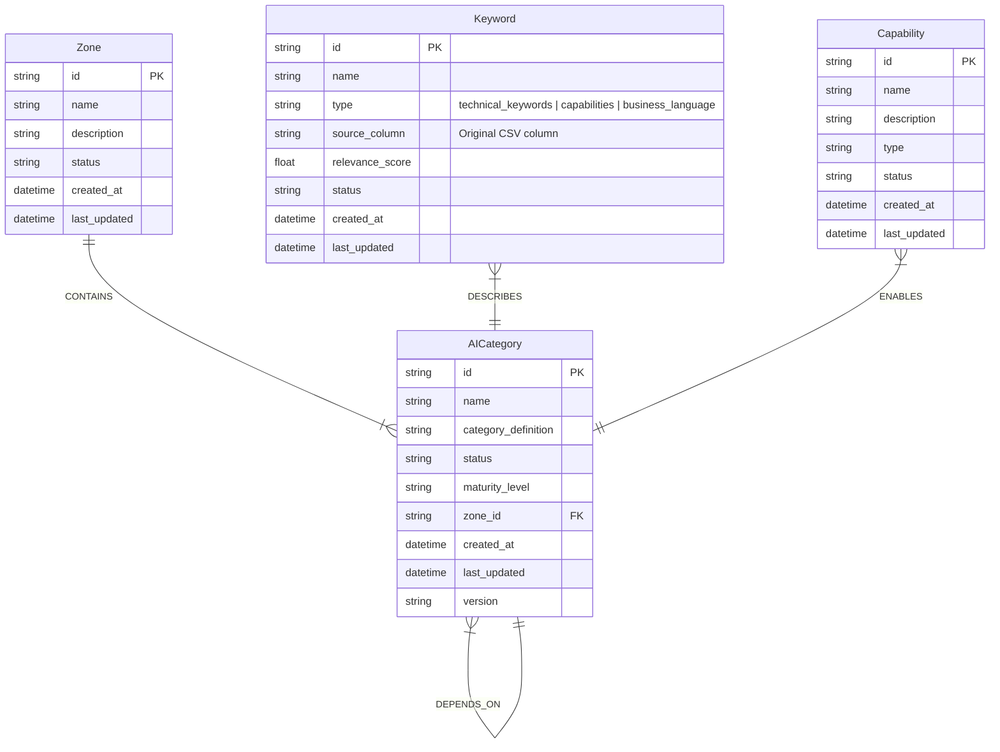
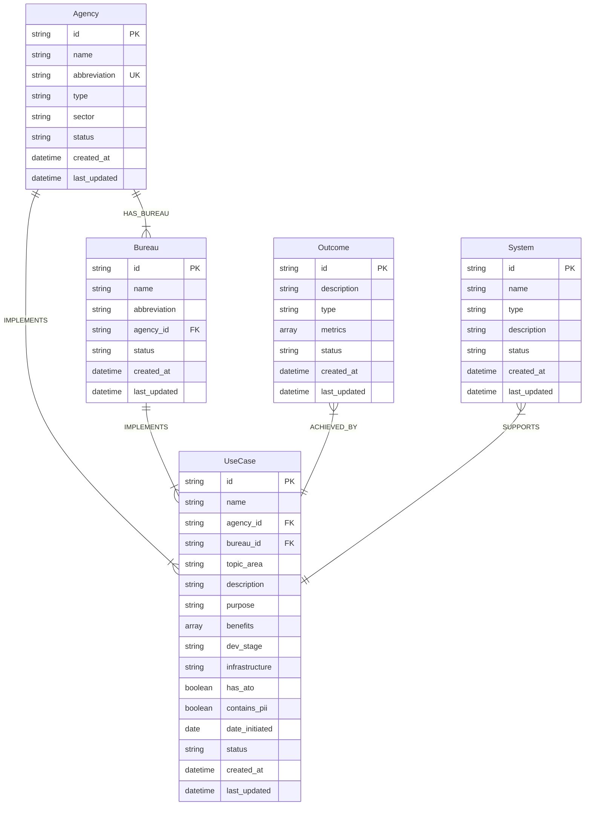
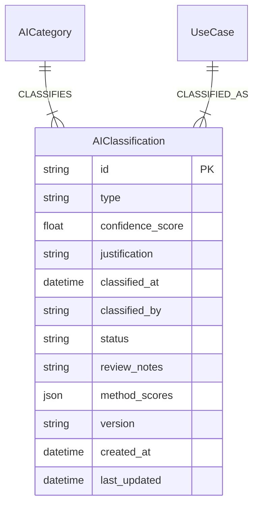
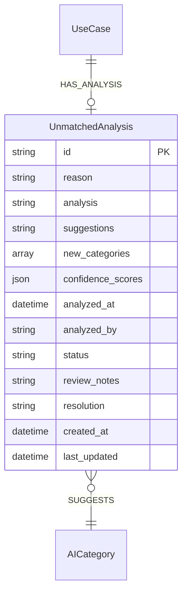
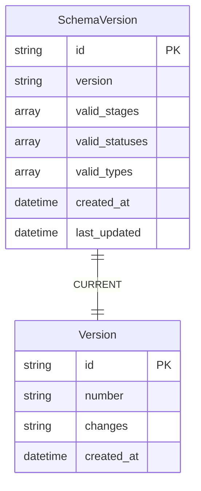

# Dell-AITC Schema Visualization V2

## Core Domain Structure



## AI Technology Categories Detail



## Federal Use Cases Detail



## Classification Detail



## Unmatched Analysis Detail



## Schema Version Control



## Legend

### Node Types
- PK: Primary Key
- FK: Foreign Key
- UK: Unique Key

### Relationship Types
- `||--|{` : One-to-many (required)
- `||--o{` : One-to-many (optional)
- `}|--||` : Many-to-one (required)
- `}o--||` : Many-to-one (optional)
- `}|--|{` : Many-to-many (required)
- `}o--o{` : Many-to-many (optional)

### Property Types
- string: Text values
- datetime: ISO format timestamps
- boolean: True/False values
- array: List of values
- json: Complex data structures
- float: Decimal numbers
``` 